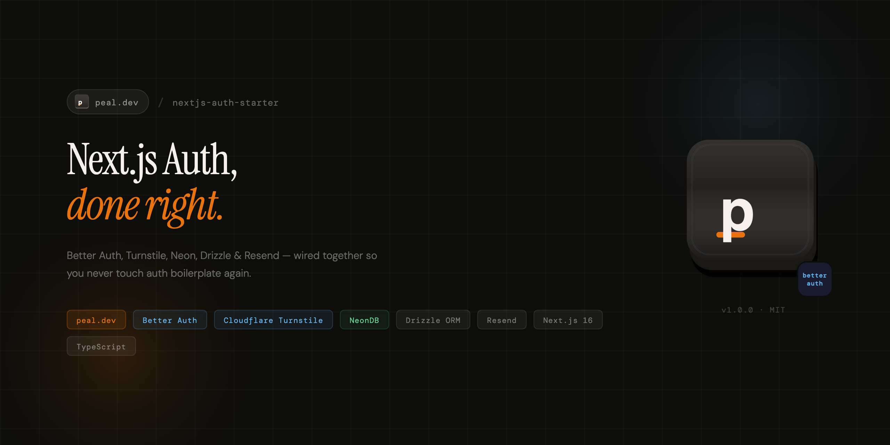

# Next.js Auth Starter

Production-ready authentication starter built with **Next.js 16**, **Better Auth**, **Drizzle ORM**, and **Neon Postgres**.

Everything is controlled from one file: [`src/auth.config.ts`](src/auth.config.ts).

---

## Stack

| Layer | Technology |
|-------|-----------|
| Framework | Next.js 16 (App Router, Server Components) |
| Auth | Better Auth |
| Database | Drizzle ORM + Neon Postgres |
| Env validation | T3 Env + Zod |
| UI | shadcn/ui + Tailwind CSS |
| Animations | Framer Motion |
| Email | Resend + React Email |
| Captcha | Cloudflare Turnstile |

---

## Features

All features are **toggleable** from `auth.config.ts`. Disable a plugin and the UI, server logic, and client code all adapt automatically.

| Feature | Config key | DB changes |
|---------|-----------|------------|
| Email & password | `emailAndPassword.enabled` | Core tables |
| Google OAuth | `socialProviders.google.enabled` | None |
| GitHub OAuth | `socialProviders.github.enabled` | None |
| Two-factor auth (TOTP) | `plugins.twoFactor.enabled` | `twoFactor` table + user fields |
| Admin (user management) | `plugins.admin.enabled` | User fields (role, banned, etc.) |
| Username | `plugins.username.enabled` | User fields (username) |
| Magic link | `plugins.magicLink.enabled` | None (uses verification table) |
| Email OTP | `plugins.emailOTP.enabled` | None |
| Passkey (WebAuthn) | `plugins.passkey.enabled` | `passkey` table |
| Phone number (SMS OTP) | `plugins.phoneNumber.enabled` | User fields (phoneNumber) |
| Bearer tokens | `plugins.bearer.enabled` | None |
| Multi-session | `plugins.multiSession.enabled` | None |
| Captcha (Turnstile) | `plugins.captcha.enabled` | None |
| OpenAPI docs | `plugins.openAPI.enabled` | None |

---

## Quick start

### 1. Clone and install

```bash
git clone <repo-url> && cd next-auth-starter
bun install
```

### 2. Set up environment variables

```bash
cp .env.example .env.local
```

Edit `.env.local` with your values:

```env
# Required
DATABASE_URL="postgresql://..."
BETTER_AUTH_SECRET="$(openssl rand -base64 32)"
BETTER_AUTH_URL="http://localhost:3000"
NEXT_PUBLIC_APP_URL="http://localhost:3000"

# Optional — enable features by adding keys
GOOGLE_CLIENT_ID=""
GOOGLE_CLIENT_SECRET=""
GITHUB_CLIENT_ID=""
GITHUB_CLIENT_SECRET=""
RESEND_API_KEY=""
EMAIL_FROM="App Name <noreply@yourdomain.com>"
TURNSTILE_SECRET_KEY=""
NEXT_PUBLIC_TURNSTILE_SITE_KEY=""
```

### 3. Set up the database

```bash
bun run db:push      # Development: push schema directly
# OR
bun run db:generate  # Production: generate migration files
bun run db:migrate   # Apply migrations
```

### 4. Run

```bash
bun run dev
```

Visit `http://localhost:3000/sign-in` to create your first account.

---

## Project structure

```
src/
├── auth.config.ts              # Central config (routes, toggles, session, cookies)
├── auth.config.server.ts       # Server-only config (secrets, OAuth creds, email)
│
├── app/
│   ├── (auth)/                 # Auth pages (sign-in, sign-up, etc.)
│   │   ├── sign-in/page.tsx
│   │   ├── sign-up/page.tsx
│   │   ├── forgot-password/page.tsx
│   │   ├── reset-password/page.tsx
│   │   └── two-factor/page.tsx
│   ├── (app)/                  # Protected pages
│   │   └── dashboard/page.tsx
│   ├── api/auth/[...all]/route.ts  # Better Auth API handler
│   ├── layout.tsx
│   └── page.tsx                # Landing page
│
├── lib/
│   ├── env.ts                  # T3 Env validation
│   ├── auth.ts                 # Better Auth server instance
│   ├── auth-client.ts          # Better Auth React client
│   ├── auth-helpers.ts         # getSession, requireSession, requireGuest
│   ├── email.ts                # Resend email sender
│   ├── emails/                 # React Email templates
│   │   ├── magic-link-email.tsx
│   │   ├── reset-password-email.tsx
│   │   └── otp-email.tsx
│   ├── types.ts                # SessionUser type
│   └── utils.ts                # Tailwind merge utility
│
├── db/
│   ├── index.ts                # Drizzle client (server-only)
│   └── schema/
│       ├── auth.ts             # All auth tables (user, session, account, etc.)
│       └── index.ts            # Barrel export
│
├── components/auth/            # Auth UI components
│   ├── auth-card.tsx           # Tabbed sign-in/sign-up card
│   ├── auth-background.tsx     # Dot grid SVG background
│   ├── sign-in-form.tsx        # Method picker + email/password
│   ├── sign-up-form.tsx        # Registration form
│   ├── sign-out-button.tsx
│   ├── forgot-password-form.tsx
│   ├── reset-password-form.tsx
│   ├── magic-link-form.tsx
│   ├── email-otp-form.tsx
│   ├── phone-sign-in-form.tsx
│   ├── phone-link.tsx          # Link phone to account (dashboard)
│   ├── two-factor-setup.tsx    # Enable/disable 2FA (dialog)
│   ├── two-factor-verify-form.tsx
│   ├── passkey-manage.tsx      # Register/delete passkeys (dashboard)
│   ├── captcha.tsx             # Cloudflare Turnstile widget
│   └── social-icons.tsx        # Google/GitHub SVG icons
│
├── hooks/
│   └── use-captcha.ts          # Captcha token state + headers
│
├── proxy.ts                    # Route protection (Next.js 16 proxy)
└── drizzle.config.ts
```

---

## Configuration guide

### Change app name

```ts
// auth.config.ts
appName: "MyApp",
```

### Rename routes

```ts
// auth.config.ts
routes: {
  signIn: "/login",        // was "/sign-in"
  signUp: "/register",     // was "/sign-up"
  afterSignIn: "/app",     // was "/dashboard"
},
```

Then rename the corresponding page folders to match.

### Protect new routes

```ts
// auth.config.ts
protection: {
  protectedPrefixes: ["/dashboard", "/settings", "/account", "/billing"],
},
```

No proxy edits needed. Re-validate in Server Components with `requireSession()`.

### Enable Google OAuth

1. Create credentials at [Google Cloud Console](https://console.cloud.google.com/apis/credentials)
2. Add to `.env.local`:
   ```env
   GOOGLE_CLIENT_ID="your-client-id"
   GOOGLE_CLIENT_SECRET="your-client-secret"
   ```
3. Set in `auth.config.ts`:
   ```ts
   socialProviders: {
     google: { enabled: true },
   },
   ```
4. Restart dev server

### Enable GitHub OAuth

1. Create an OAuth App at [GitHub Developer Settings](https://github.com/settings/developers)
2. Set callback URL to `http://localhost:3000/api/auth/callback/github`
3. Add to `.env.local`:
   ```env
   GITHUB_CLIENT_ID="your-client-id"
   GITHUB_CLIENT_SECRET="your-client-secret"
   ```
4. Set in `auth.config.ts`:
   ```ts
   socialProviders: {
     github: { enabled: true },
   },
   ```

### Enable email (Resend)

Required for magic link, email OTP, password reset, and email verification.

1. Get an API key at [resend.com](https://resend.com)
2. Add to `.env.local`:
   ```env
   RESEND_API_KEY="re_..."
   EMAIL_FROM="App Name <noreply@yourdomain.com>"
   ```

Email templates are in `src/lib/emails/`. They use React Email with inline styles.

### Enable Cloudflare Turnstile captcha

1. Create a widget at [Cloudflare Dashboard](https://dash.cloudflare.com/?to=/:account/turnstile)
2. Add to `.env.local`:
   ```env
   TURNSTILE_SECRET_KEY="0x..."
   NEXT_PUBLIC_TURNSTILE_SITE_KEY="0x..."
   ```
3. Captcha activates automatically. It runs invisibly and only shows a challenge if bot activity is detected.

### Enable phone number authentication

1. Set in `auth.config.ts`:
   ```ts
   plugins: {
     phoneNumber: { enabled: true },
   },
   ```
2. **Implement your SMS provider** in `src/lib/auth.ts` — find the `phoneNumber` plugin section and replace the `console.log` stub with your provider (Twilio, Vonage, AWS SNS, etc.):
   ```ts
   phoneNumber({
     sendOTP: async ({ phoneNumber: phone, code }) => {
       // Example with Twilio:
       // await twilioClient.messages.create({
       //   body: `Your code is ${code}`,
       //   from: "+1234567890",
       //   to: phone,
       // });
     },
   }),
   ```
3. Run `bun run db:push` to add phone fields to the user table

### Enable two-factor authentication

Already enabled by default. Users can set it up from the dashboard:
1. Enter password
2. Scan QR code with authenticator app
3. Save backup codes
4. Verify with a 6-digit code

### Enable passkeys

Already enabled by default. Users can manage passkeys from the dashboard:
- Register Face ID, Touch ID, or security keys
- Sign in with one click from the sign-in page

### Session and cookie settings

```ts
// auth.config.ts
session: {
  expiresIn: 60 * 60 * 24 * 30,  // 30 days
  updateAge: 60 * 60 * 24,        // refresh once per day
  cookieCache: {
    enabled: true,
    maxAge: 60 * 5,                // 5 min fast reads
  },
},
cookies: {
  prefix: "yourapp",               // cookie name prefix
  secure: process.env.NODE_ENV === "production",
  sameSite: "lax",
},
```

---

## Server-side auth helpers

```ts
import { getSession, requireSession, requireGuest } from "@/lib/auth-helpers";

// Optional session (returns null if not logged in)
const session = await getSession();

// Required session (redirects to sign-in if not logged in)
const session = await requireSession();

// Guest-only (redirects to dashboard if logged in)
await requireGuest();
```

These are cached per-request via React `cache()`. Safe to call multiple times in one render.

---

## Database

### Generate a migration

```bash
bun run db:generate
```

Review the generated SQL in `./drizzle/`, then apply:

```bash
bun run db:migrate
```

### Browse data

```bash
bun run db:studio
```

### Schema types

```ts
import type { User, NewUser, Session } from "@/db/schema";
```

Never write `interface User { ... }` by hand. Use `$inferSelect` / `$inferInsert`.

---

## Architecture decisions

- **`auth.config.ts`** is shared between server and client. It must NOT import `env.ts` (which contains server secrets). Use `process.env.NEXT_PUBLIC_*` only.
- **`auth.config.server.ts`** has `import "server-only"` and contains OAuth credentials, email config, and captcha secrets.
- **Pages are Server Components.** Interactive parts (forms, buttons) are extracted into `"use client"` components.
- **Proxy (not middleware).** Next.js 16 uses `proxy.ts` instead of the deprecated `middleware.ts`. It checks cookie presence only — always re-validate with `requireSession()` in Server Components.
- **Email templates** use React Email with inline styles for maximum email client compatibility.
- **Captcha** uses Cloudflare Turnstile in `interaction-only` mode — invisible by default, challenge only when suspicious.

---

## Common tasks

| Task | What to do |
|------|-----------|
| Add a protected route | Add prefix to `authConfig.protection.protectedPrefixes` |
| Rename `/sign-in` to `/login` | Change `authConfig.routes.signIn`, rename page folder |
| Add a DB column | Edit `src/db/schema/*.ts` → `bun run db:generate` → `bun run db:migrate` |
| Change password rules | Edit `authConfig.emailAndPassword.minPasswordLength` |
| Increase session lifetime | Edit `authConfig.session.expiresIn` |
| Require email verification | Set `authConfig.emailAndPassword.requireEmailVerification: true` |
| Disable a plugin | Set `plugins.xxx.enabled: false` in `auth.config.ts` |
| Add an API endpoint with auth | Use `requireSession()` from `auth-helpers.ts` |
| View API docs | Enable `plugins.openAPI` and visit `/api/auth/reference` |

---

## Anti-patterns

- `import { db } from "@/db"` in a Client Component
- Hardcoding `"/sign-in"` — import from `authConfig.routes`
- Reading `process.env.X` directly — use `env` from `@/lib/env`
- `drizzle-kit push` in production — use `generate` + `migrate`
- Pluralizing auth tables (`users` instead of `user`)
- Writing `interface User { ... }` — use `typeof user.$inferSelect`
- Trusting proxy as the only protection — always re-check in Server Components

---

## License

MIT
